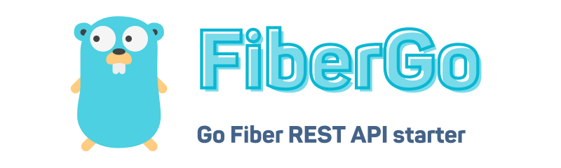

<p align="center"></p>
<p align="center">
    <a href="https://github.com/riipandi/fibergo/pulse">
        
    </a>
    <a href="https://github.com/riipandi/fibergo">
        
    </a>
    <a href="https://aris.mit-license.org">
        
    </a>
</p>

## Introduction

Starter template Golang REST with Fiber framework.

## Quick Start

```bash
degit riipandi/fibergo myapp-name
```

> Don't forget to change `myapp-name` with your real application name.

### Prerequisite

1. Install Docker and Docker Compose : https://docs.docker.com/desktop

### Generate Secret Key

Before you continue, you need to create `.env` file (you can duplicate `.env.example`) and
fill the `application secret key` with some random string. To generate a secret key, use
the following command:

```sh
openssl rand -base64 500 | tr -dc 'a-zA-Z0-9' | fold -w 32 | head -n 1
```

## Thanks to...

In general, I'd like to thank every single one who open-sources their
source code for their effort to contribute something to the open-source
community. Your work means the world! 🌍 ❤️


## License

This project is open-sourced software licensed under the [MIT license](https://aris.mit-license.org).

Copyrights in this project are retained by their contributors.
See the [license file](./LICENSE.txt) for more information.
